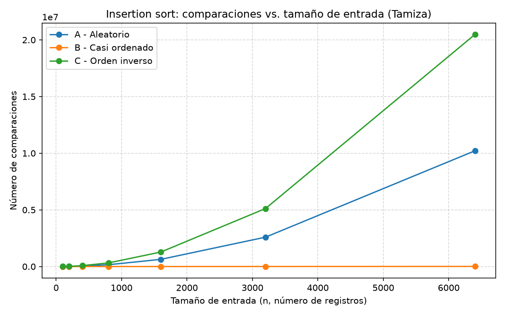
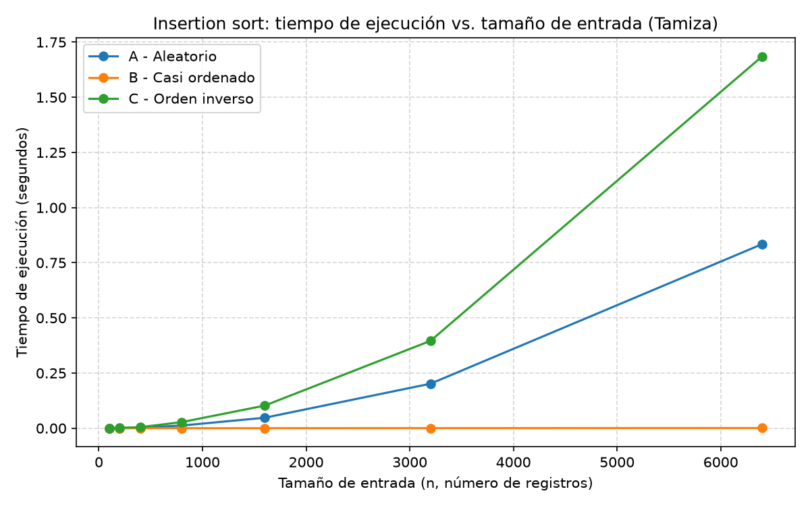
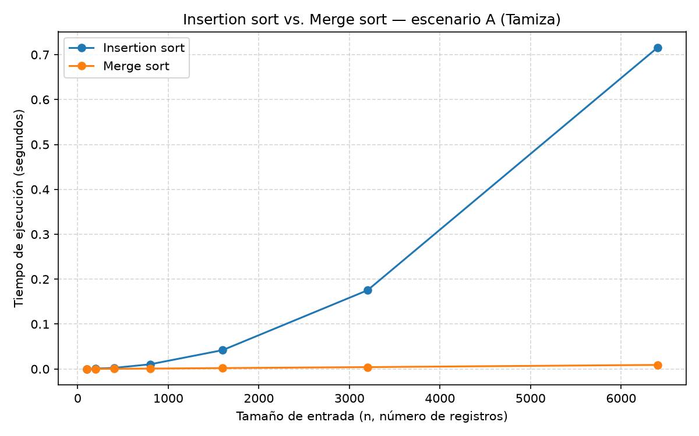

# Laboratorio 1 - Fundamentos, complejidad y recurrencias

**Autor:** Samuel Quiroz Rincón

**Grupo:** 190304006-1 (Asincrónico)

## Instrucciones para reproducir el laboratorio

1. En la raíz del repositorio y activar el entorno virtual en bash:

   ```bash
   source venv/bin/activate
   pip install -r requirements.txt
   ```

2. Entrar a la carpeta de este laboratorio:

   ```bash
   cd lab1-fundamentos-complejidad-recurrencias
   ```

3. Para reproducir la Parte 3 (peor/mejor/promedio caso e insertion sort instrumentado):

   ```bash
   python parte3_casos.py
   ```

   Esto imprime en consola el tiempo y las comparaciones por escenario y tamaño, y regenera `graficas/parte3_comparaciones.png` y `graficas/parte3_tiempo.png`.

4. Para reproducir la Parte 4 (insertion sort vs. merge sort):

   ```bash
   python parte4_complejidad.py
   ```

   Esto regenera `graficas/parte4_tiempo.png`.


## Parte 1 - Analizar el algoritmo antes de comprar hardware

Que Tamiza lleve ocho años funcionando dice que el algoritmo es correcto y funciona. Dado un lote de registros, insertion sort siempre entrega la lista ordenada por índice de riesgo. Corrección es una propiedad binaria del resultado, independiente del tiempo que tome producirlo. Lo que está fallando no es eso, sino que es la eficiencia, la cual se entiende aquí como el tiempo de cómputo que el proceso consume frente a un recurso concreto y escaso, como la ventana de las 2:00 a. m. a las 6:00 a. m. Esa ventana es la restricción que el sistema incumple, y no es negociable porque el centro de contacto abre a las 6:00 a. m. y depende de una lista completa para priorizar a los pacientes de mayor riesgo. Un algoritmo puede ser correcto y, al mismo tiempo, inviable frente a esa restricción de tiempo, por lo que producir la respuesta correcta a las 9:00 a. m., cuando el centro de contacto ya lleva tres horas llamando sin lista, no sirve para el propósito del sistema.

Ahora bien, duplicar la velocidad del servidor no resuelve el problema de fondo porque insertion sort tiene un costo que crece con el cuadrado del número de registros, entonces al doblar el tamaño de la entrada, el trabajo se multiplica aproximadamente por cuatro y con un servidor del doble de velocidad solo se estaría reduciendo el tiempo de cómputo, en el mejor de los casos, a la mitad. Pero el programa no va a quedarse en 1.200.000 de registros, la Secretaría en algún punto buscará ampliar la cobertura de nuevo con más municipios o más laboratorios, entonces el número de registros vuelve a crecer, y como el costo crece con el cuadrado, cualquier ganancia de hardware se consume rápidamente en la siguiente ampliaciónm, por lo que se estaría comprando tiempo, no resolviendo la causa; la curva de crecimiento del algoritmo es la que determina si el sistema escala o no, y ningún servidor cambia esa curva.

Otro ejemplo sucede en soporte de TI donde Trabajo, en la mesa de ayuda que usamos en ServiceNow. Los tickets críticos tienen un SLA de 2 horas, pero la tabla de incidentes acumula más de 6 millones de registros, y consultas como filtrar tickets críticos abiertos por grupo de soporte recorrían la tabla completa registro por registro en vez de usar un índice, así que su tiempo crecía con el historial total, no con los tickets relevantes. Antes del cambio tardaban entre 10 y 15 segundos; con varios analistas consultando a la vez en un pico de críticos, ese tiempo se sumaba en cada paso y comprometía el SLA. La consulta era correcta, pero demasiado lenta. La solución no fue un servidor más rápido, sino que fue indexar en ServiceNow los campos más filtrados (prioridad, estado, grupo asignado), y las mismas consultas bajaron a 4-8 segundos, casi la mitad, sin tocar el hardware, solo cambiando cómo se busca en los datos.


## Parte 2 - Responsabilidad ambiental y ética de la implementación

En cuanto a la responsabilidad ambiental, el proceso nocturno de la empresa Tamiza consume energía eléctrica en función del tiempo que el servidor permanece ocupado ordenando, entonces mientras que la CPU procesa comparaciones e intercambios, consume potencia; cuantos más ciclos de reloj requiera el algoritmo, más tiempo el servidor está en carga y más energía se factura y se emite en consumo eléctrico. Ese costo no es un evento aislado, pues el proceso corre todas las madrugadas, sin excepción, durante los años que el sistema esté en producción. Un algoritmo cuadrático como insertion sort, comparado con otro algortimo de orden n log n, no gasta solo "un poco más" de energía, sino que gasta una cantidad que crece con el tamaño del lote, y ese múltiplo se repite y se acumula noche tras noche. En este contexto, si se elige un algortimo ineficiente no es una decisión de una sola vez, es una decisión que se paga, en electricidad y en huella de carbono asociada, cada día que el sistema sigue funcionando de esta manera.

Por otro lado, si se habla de manera ética, se puede visualizar de dos formas concretas en qcomo la lentitud o el fallo de este algoritmo perjudican a una persona identificable:

1. Por ejemplo, si un paciente con un índice de riesgo alto queda en una posición equivocada de la lista porque el proceso no terminó a tiempo y el centro de contacto trabajó con una lista parcial sin ser ordenada por riesgo. Ese paciente puede no ser llamado a tiempo para una valoración médica que necesitaba con urgencia. El costo de ese error lo asume, en primer lugar el paciente, cuya atención se retrasa. En segundo lugar, lo asume el operador del centro de contacto, que llama sin la priorización correcta y sin saber que está haciéndolo, y finaolmente lo asume la Secretaría, que responde ante el departamento por la efectividad del programa.
2. Por otro lado, el equipo de desarrollo que decidió dejar el algoritmo como está porque funciona, traslada un riesgo técnico que no gestionó hacia quien no tiene forma de saber que existe, o sea el paciente; el cual no sabe que la razón por la que nadie lo llamó a tiempo. Lo que se traduce a que el costo silencioso de mantener un sistema que funcionaba bien con una cantidad menor de datos desde hace 8 años lo asume, sin saberlo, la persona con menos poder de decisión en toda la cadena.

Se debe tener muy en cuenta que el orden de la lista no es un detalle estético, sino que decide literalmente a quién se llama primero cuando hay 1.200.000 personas y un centro de contacto que no puede llamarlas a todas de inmediato. Eso impone una obligación que va más allá de que el proceso termine a tiempo. El ordenamiento tiene que ser exactamente correcto, sin errores de comparación ni pérdidas de registros, porque cualquier inversión de orden entre dos pacientes con distinto riesgo no es un error de redondeo sin consecuencias, es una decisión, aunque sea involuntaria, de a quién se prioriza y a quién se pospone. Optimizar el algoritmo por velocidad no puede hacerse a costa de introducir errores de exactitud en el criterio de orden; velocidad y exactitud del criterio son, aquí, requisitos igual de innegociables.


## Parte 3 - Peor caso, mejor caso y caso promedio, demostrados en Python

Código de esta parte: [parte3_casos.py](parte3_casos.py), que usa las funciones de [algoritmos.py](algoritmos.py) y [datos.py](datos.py).

### 3.1 - Explicación

- **Peor caso:** para un tamaño de entrada fijo *n*, es el máximo del costo (tiempo o número de comparaciones) tomado sobre todas las entradas posibles de tamaño n. No es "una entrada mala cualquiera": es la entrada específica de tamaño *n* que maximiza el trabajo del algoritmo.
- **Mejor caso:** para el mismo tamaño fijo *n*, es el mínimo del costo tomado sobre todas las entradas posibles de tamaño *n*: la entrada que menos trabajo le exige al algoritmo.
- **Caso promedio:** para el mismo tamaño fijo *n*, es el promedio del costo, ponderado por la probabilidad de cada entrada posible de tamaño *n*, bajo un supuesto explícito sobre esa distribución de probabilidad (en insertion sort, el supuesto habitual es que las n! permutaciones de los datos son igualmente probables).

Para decidir si el algoritmo de Tamiza entra en producción usaría el peor caso. La ventana de cuatro horas es una restricción estricta que debe cumplirse siempre, no en promedio. Si el sistema falla una de cada diez madrugadas porque ese día llegó una entrada cercana al peor caso, ya incumplió su restricción de negocio. El caso promedio sirve para estimar el comportamiento típico, pero no da una garantía; el peor caso sí, porque acota el tiempo máximo que el proceso puede tardar sin importar cómo lleguen los datos ese día.

**Predicción (antes de medir):** para insertion sort, el escenario C (orden inverso) debería ser el peor caso, porque cada elemento nuevo debe compararse y desplazarse contra todos los elementos ya colocados antes de él, generando el número máximo de comparaciones e intercambios posible. El escenario B (casi ordenado) debería ser el mejor caso, porque el 98% del lote ya está en su posición final y cada uno de esos elementos requiere apenas una comparación para confirmar que no debe moverse; solo el 2% final exige trabajo real. El escenario A (aleatorio) debería aproximarse al caso promedio, al no tener ninguna estructura de orden previa.

### 3.2 - Demostración experimental





Con n = 6.400, insertion sort realizó:

| Escenario | Comparaciones | Tiempo |
|---|---|---|
| A - Aleatorio | 10.212.819 | 0.834335s |
| B - Casi ordenado | 10.277 | 0.000860s |
| C - Orden inverso | 20.476.800 | 1.685474s |

Con estos datos, se sabe que el experimento confirma la predicción. El escenario C es, con claridad, el peor caso (curva más alta en ambas gráficas, creciendo de forma cuadrática), el escenario B es el mejor caso (su curva es casi plana, prácticamente lineal), y el escenario A se comporta como el caso promedio esperado. La cercanía numérica es notable: la cota teórica del peor caso de insertion sort es n(n−1)/2, que para n = 6.400 da 20.476.800 comparaciones, lo cual es exactamente lo medido en el escenario C, y la cota teórica del caso promedio es aproximadamente n(n−1)/4 ≈ 10.238.400, casi idéntica a las 10.212.819 comparaciones medidas en el escenario A. Los datos no solo confirman el orden de los tres escenarios; confirman las constantes exactas que predice el análisis en papel.


## Parte 4 - Complejidad de merge sort e insertion sort: cálculo y validación

Código de esta parte: [parte4_complejidad.py](parte4_complejidad.py), que también usa las funciones de [algoritmos.py](algoritmos.py) y [datos.py](datos.py).

### 4.1 - Cálculo teórico

**Recurrencia de merge sort.**

```
T(n) = 2·T(n/2) + Θ(n)
```

- `2T(n/2)`: dividir el lote de tamaño *n* por la mitad genera 2 subproblemas, cada uno de tamaño n/2, y ordenarlos recursivamente cuesta T(n/2) cada uno.
- `Θ(n)`: combinar (la mezcla) recorre las dos mitades ya ordenadas una sola vez, de principio a fin, comparando sus elementos por pares; ese recorrido lineal cuesta Θ(n), sin importar cómo estaban ordenadas las mitades.

**Resolución por método maestro.**

Identificando a, b y f(n) en T(n) = a·T(n/b) + f(n):

- a = 2 (número de subproblemas)
- b = 2 (factor de reducción del tamaño)
- f(n) = Θ(n) (costo de combinar)

Se calcula n^(log_b a) = n^(log₂2) = n¹ = n.

Se compara f(n) con n^(log_b a): f(n) = Θ(n) = Θ(n¹ · log⁰n), es decir, f(n) es asintóticamente igual a n^(log_b a) (con k = 0 en el factor logarítmico). Esta es exactamente la condición del caso 2 del método maestro (f(n) = Θ(n^(log_b a) · log^k n) con k ≥ 0).

Por el caso 2, la solución es:

```
T(n) = Θ(n^(log_b a) · log^(k+1) n) = Θ(n · log n)
```

**Cota de insertion sort, línea a línea.**

Usando la implementación de [algoritmos.py](algoritmos.py):

```python
for i in range(1, len(lista)):        # se ejecuta n-1 veces
    actual = lista[i]                 # n-1 veces
    j = i - 1                         # n-1 veces
    while j >= 0:                     # tᵢ veces en la iteración i
        comparaciones += 1            # tᵢ veces
        if lista[j] > actual:         # tᵢ veces
            lista[j+1] = lista[j]     # (tᵢ - 1) o tᵢ veces, según el caso
            j -= 1                    # ídem
        else:
            break
    lista[j+1] = actual               # n-1 veces
```

Sea tᵢ el número de comparaciones internas del ciclo `while` para el elemento en la posición *i*. El costo total tiene la forma:

```
T(n) = c₁(n-1) + c₂·Σtᵢ + c₃·Σ(tᵢ - 1)
```

donde las sumatorias van de i = 1 a n−1.

- **Mejor caso** (lista ya ordenada, escenario B en su versión ideal): cada elemento se compara una sola vez con su antecesor y no se desplaza (tᵢ = 1 para todo i). La sumatoria es lineal en n, así que T(n) = Θ(n).
- **Peor caso** (lista en orden inverso, escenario C): cada elemento nuevo debe compararse y desplazarse contra **todos** los anteriores (tᵢ = i). La sumatoria Σi para i = 1 hasta n−1 es n(n−1)/2, un polinomio de grado 2 en n, así que T(n) = Θ(n²).
- **Caso promedio** (orden aleatorio, escenario A): en promedio cada elemento se compara con la mitad de los anteriores ya colocados (tᵢ ≈ i/2). La sumatoria sigue siendo un polinomio de grado 2 en n, con una constante menor, así que T(n) sigue siendo Θ(n²).

**Tabla de complejidades esperadas.**

| Algoritmo | Mejor caso | Peor caso | Caso promedio |
|---|---|---|---|
| Insertion sort | Θ(n) | Θ(n²) | Θ(n²) |
| Merge sort | Θ(n log n) | Θ(n log n) | Θ(n log n) |

### 4.2 - Validación experimental



La curva de insertion sort se dobla hacia arriba cada vez con más fuerza a medida que crece *n*, al pasar de 3.200 a 6.400 registros (el doble de datos), su tiempo pasa de 0.175284 s a 0.715423 s, es decir, se multiplica por 4, consistente con un crecimiento cuadrático. La curva de merge sort, en cambio, crece de forma mucho más suave, en el mismo salto de 3.200 a 6.400 registros, su tiempo pasa de 0.004130 s a 0.009032 s, apenas se duplica lo cual es consistente con un crecimiento n log n.

Esta conclusión coincide con las complejidades calculadas en 4.1, Θ(n²) frente a Θ(n log n) predice justamente esa diferencia en cómo reacciona cada curva al doblar el tamaño de la entrada. Para los tamaños más pequeños (n = 100, n = 200) ambas curvas se ven casi planas y muy cercanas entre sí; esto se explica porque a esa escala el tiempo total está dominado por constantes de overhead de Python (creación de listas, llamadas a función) y no por el término asintótico dominante, que solo se vuelve visible cuando *n* crece lo suficiente para que n² o n log n superen ese overhead fijo.

### 4.3 - Concepto técnico a la Secretaría de Salud

**Para:** Equipo de ingeniería, Secretaría de Salud departamental - plataforma Tamiza

**De:** Samuel Quiroz Rincón

**Asunto:** Concepto técnico sobre el ordenamiento nocturno y la propuesta de ampliación de hardware

Recomiendo reemplazar insertion sort por merge sort como algoritmo único de ordenamiento del proceso nocturno de Tamiza, sin mantener implementaciones distintas por canal de origen. El criterio detrás de esta recomendación es la robustez frente al tipo de entrada, pues insertion sort tiene un desempeño que depende fuertemente de cómo llegan los datos (Θ(n) si llegan casi ordenados, Θ(n²) si llegan en orden inverso), mientras que merge sort tiene el mismo desempeño, Θ(n log n), sin importar si el lote llega aleatorio, casi ordenado o invertido. Dado que el canal de origen puede cambiar sin aviso lo que lleva a que por ejemplo hoy es reproceso casi ordenado, mañana puede ser una migración en orden inverso, entonces un algoritmo cuyo comportamiento no depende de esa condición es la opción más viable con una sola base de código.

Con las mediciones tomadas sobre el escenario A y graficadas en `graficas/parte4_tiempo.png`, extrapolo el tiempo a 1.200.000 registros ajustando, para cada algoritmo, una constante c a partir del punto medido en n = 6.400 y su forma asintótica (c·n² para insertion sort, c·n·log₂n para merge sort), y evaluando esa misma fórmula en n = 1.200.000. Insertion sort, con 0.715423 s medidos en n = 6.400, se proyecta en aproximadamente 25.518 segundos (≈ 6 horas 59 minutos) para 1.200.000 registros: casi el doble de la ventana disponible. Merge sort, con 0.009032 s medidos en el mismo n = 6.400, se proyecta en aproximadamente 2,70 segundos para el mismo volumen. Insisto en que esto es una estimación por extrapolación, no una medición directa sobre 1.200.000 registros, y que el comportamiento real de un servidor de producción (memoria caché, paginación, carga concurrente) puede desviarse de esta proyección, especialmente para insertion sort a ese tamaño.

Sobre comprar un servidor del doble de velocidad: asumiendo de forma optimista que eso reduce el tiempo de cómputo exactamente a la mitad, insertion sort pasaría de ≈≈ 6 horas 59m a ≈3 h 30 min, apenas por debajo del límite de 4 horas, con un margen de solo unos 30 minutos. Es demasiado estrecho para un proceso que ya ha fallado tres veces y seguirá creciendo. Por otro lado cualquier lote más grande de lo habitual, o un supuesto de velocidad menos optimista, consume ese margen. Merge sort, sin comprar ningún servidor, deja un margen de más de 3 h 59 min sobre la misma ventana, lo que nos da a entender que la diferencia no es de grado, sino de orden de magnitud.

Una consideración distinta del tiempo es que nuestro merge sort usa memoria adicional proporcional a *n* para las mezclas, mientras insertion sort ordena in situ; para 1.200.000 enteros esa memoria extra es de pocos megabytes, trivial frente al beneficio en tiempo. Podemos asumir que ambos son estables, sin diferencia en empates de riesgo. Pero es un riesgo latente el conservar insertion sort confiando en que el escenario B seguirá siendo el más frecuente, ya que ese supuesto depende de un reproceso que el equipo de datos podría cambiar sin avisar, y ahí el sistema volvería a fallar sin previo aviso. Merge sort no depende de que ese supuesto se mantenga.
