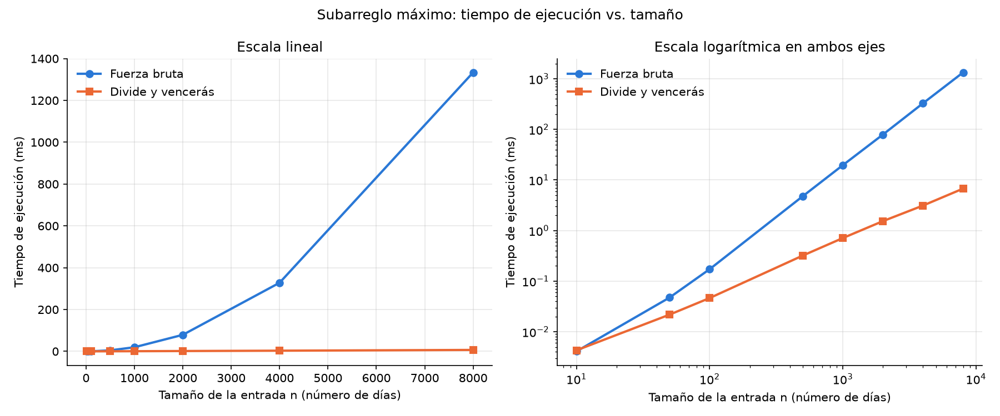

# Laboratorio 2 — Divide y vencerás: subarreglo máximo

**Autor:** Samuel Quiroz Rincón

**Grupo:** 190304006-1 (Asincrónico)

## Cómo reproducir el experimento

Desde la raíz del repositorio, active el entorno virtual e instale las
dependencias:

```bash
# Linux / macOS
source .venv/bin/activate

# Windows (PowerShell)
.venv\Scripts\Activate.ps1

pip install -r requirements.txt
```

## Parte 1 — Implementación y verificación

Código: [subarreglo.py](subarreglo.py) · Pruebas: [pruebas.py](pruebas.py)

`pruebas.py` es un script con `assert` que compara la **suma** que devuelve
cada algoritmo (no los índices, porque puede haber varios tramos con la misma
suma). Además comprueba que los índices devueltos realmente sumen ese valor y
que la lista recibida no cambie. Casos cubiertos:

- La serie de ocho días de la situación problema (suma 17).
- Series de un solo elemento, positivo y negativo.
- Todos los valores negativos (la respuesta es el día menos malo).
- Todos los valores positivos (la respuesta es la serie completa).
- Un caso donde el mejor tramo cruza el punto medio, verificando también
  `suma_cruzada` directamente.
- Casos donde el mejor tramo queda completo en la mitad izquierda o derecha.
- 200 listas aleatorias (semilla fija, entre 1 y 60 elementos) en las que
  ambas funciones deben dar la misma suma.

## Parte 2 — Medición y gráfica

Código: [medicion.py](medicion.py)



Cómo se midió:

- Tamaños: 10, 50, 100, 500, 1000, 2000, 4000 y 8000.
- Datos enteros entre -100 y 100 generados con semilla fija (2026); en cada
  tamaño ambos algoritmos reciben la misma lista.
- Solo se cronometra la llamada al algoritmo con `time.perf_counter()`; la
  generación de los datos queda por fuera.
- Cada medición se repite 5 veces y se conserva el menor tiempo, que es el
  menos afectado por otros procesos del equipo.
- En cada tamaño un `assert` verifica que ambos algoritmos dan la misma suma.
- El panel izquierdo de la gráfica está en escala lineal y el derecho en
  escala logarítmica, para poder ver también los tamaños pequeños.

Tiempos medidos en mi equipo:

| n    | Fuerza bruta (ms) | Divide y vencerás (ms) |
|-----:|------------------:|-----------------------:|
| 10   |            0.0041 |                 0.0043 |
| 50   |            0.0474 |                 0.0218 |
| 100  |            0.1724 |                 0.0464 |
| 500  |            4.7659 |                 0.3202 |
| 1000 |           19.5975 |                 0.7111 |
| 2000 |           78.9639 |                 1.5358 |
| 4000 |          328.0061 |                 3.1213 |
| 8000 |         1333.7090 |                 6.7479 |